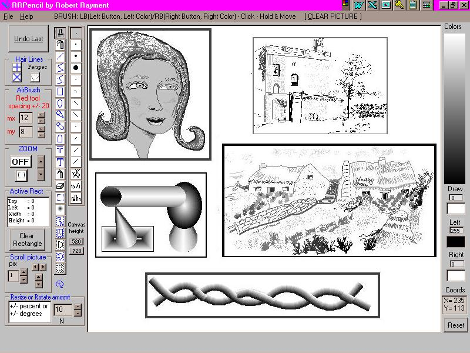



## RRPencil

### Description

I love pencil drawing and there's nothing to beat pencil

and paper. On the computer the mouse never moves as easily as a

pencil but mathematics does allow some types of drawing to be

carried out much more quickly than would be possible by hand.

This is a pencil drawing programme with 256 shades of grey.

It has 21 drawing tools and a host of sub-tools all easily

selected from on-screen toolbars. Many shaded shapes such as

curved lines, tubes, cones etc can be drawn. All the standard picture

formats can be loaded or added and re-positioned. Saving is either

as a BMP or a JPG file. Any rectangular part of the picture can be

saved. JPG saving and printing is accomplished by using a single exe,

free-standing, freeware conversion program that takes a command

line and is hence easily used in VB. The source and credits for this

are included in the .zip file In addition to the tools there is a zoom

facility, whole-picture scrolling, +, X & perspective hair-lines, settable

brick & tile sizes, text with any font, size or angle, undo and two

canvas sizes suitable for A4 paper. All the source files, including

button bitmaps, are included. The .zip file is just over 1MB and the

program is written for an 800x600 screen.
 
### More Info
 

             |
---                |---
**Submitted On**   |2000-09-17 07:46:48
**By**             |[Robert Rayment](https://github.com/Planet-Source-Code/PSCIndex/blob/master/ByAuthor/robert-rayment.md)
**Level**          |Advanced
**User Rating**    |5.0 (125 globes from 25 users)
**Compatibility**  |VB 5\.0, VB 6\.0
**Category**       |[Complete Applications](https://github.com/Planet-Source-Code/PSCIndex/blob/master/ByCategory/complete-applications__1-27.md)
**World**          |[Visual Basic](https://github.com/Planet-Source-Code/PSCIndex/blob/master/ByWorld/visual-basic.md)
**Archive File**   |[CODE\_UPLOAD100059192000\.zip](https://github.com/Planet-Source-Code/robert-rayment-rrpencil__1-11557/archive/master.zip)

